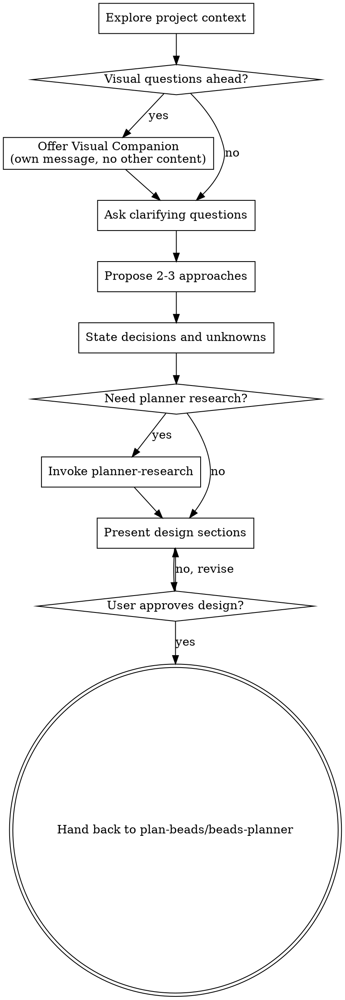

# Brainstorming Ideas Into Designs

Help turn ideas into an approved Beads-ready design through natural collaborative dialogue.

In this template, `brainstorming` is the primary discuss stage. Use it to lock intent, separate decisions from assumptions, and identify any factual unknowns early enough that `planner-research` can resolve them before Beads are created.

Start by understanding the current project context, then ask questions one at a time to refine the idea. Once you understand what you're building, present the design and get user approval.

<HARD-GATE>
This is a planner skill. Do NOT invoke any implementation skill, write any code, scaffold any project, claim a bead, or take any implementation action. The goal is an approved design that can flow into `planner-research` or `beads-planner`, not executor planning.
</HARD-GATE>

## Anti-Pattern: "This Is Too Simple To Need A Design"

Every project goes through this process. A todo list, a single-function utility, a config change - all of them. "Simple" projects are where unexamined assumptions cause the most wasted work. The design can be short (a few sentences for truly simple projects), but you MUST present it and get approval.

## Checklist

You MUST create a task for each of these items and complete them in order:

1. **Explore project context** - check files, docs, and recent commits
2. **Offer visual companion** (if topic will involve visual questions) - this is its own message, not combined with a clarifying question. See the Visual Companion section below.
3. **Ask clarifying questions** - one at a time, understand purpose, constraints, and success criteria
4. **Propose 2-3 approaches** - with trade-offs and your recommendation
5. **State what is already decided vs still unknown** - explicitly separate locked decisions, assumptions, and factual unknowns
6. **Use `planner-research` if needed** - only when unresolved factual unknowns would weaken the design or produce poor Beads
7. **Present the approved design** - in sections scaled to complexity, including swarm-relevant constraints when parallel execution may matter
8. **Stop at planner handoff** - hand the approved design back to `plan-beads`, `planner-research`, or `beads-planner`

## Process Flow

**The terminal state is planner handoff.** Do NOT invoke `writing-plans`, `swarm-epic`, `beads-claim`, or any implementation skill from `brainstorming`.

## The Process

**Understanding the idea:**

- Check out the current project state first (files, docs, recent commits)
- Before asking detailed questions, assess scope: if the request describes multiple independent subsystems (for example, "build a platform with chat, file storage, billing, and analytics"), flag this immediately. Do not spend questions refining details of a project that needs to be decomposed first.
- If the project is too large for a single design, help the user decompose into sub-projects: what are the independent pieces, how do they relate, what order should they be built? Then brainstorm the first sub-project through the normal design flow. Each sub-project gets its own discuss -> plan -> execution cycle.
- For appropriately scoped projects, ask questions one at a time to refine the idea.
- Prefer multiple choice questions when possible, but open-ended is fine too.
- Only one question per message. If a topic needs more exploration, break it into multiple questions.
- Focus on understanding: purpose, constraints, success criteria, and any swarm-specific constraints if the work may later be parallelized.
- Before presenting the design, explicitly call out:
  - goals and success criteria
  - decisions that are already locked
  - assumptions that are still provisional
  - factual unknowns that need research before planning can be trusted

**Exploring approaches:**

- Propose 2-3 different approaches with trade-offs.
- Present options conversationally with your recommendation and reasoning.
- Lead with your recommended option and explain why.

**Escalating to planner research:**

- Use `planner-research` only for factual unknowns that materially affect the design or bead decomposition.
- Good triggers: unknown integration points, unclear library or platform behavior, uncertain repo conventions, external API constraints, or open feasibility questions.
- Do not use `planner-research` just to avoid asking the user preference questions.
- After research, fold findings into the approved design and later bead descriptions or notes. Do not create a separate planning tracker or second source of truth.

**Presenting the design:**

- Once you believe you understand what you're building, present the design.
- The design should leave the next planner skill enough structure to create high-quality Beads without replaying the full conversation.
- Scale each section to its complexity: a few sentences if straightforward, up to 200-300 words if nuanced.
- Ask after each section whether it looks right so far.
- Cover: architecture, components, data flow, error handling, testing, and swarm-relevant constraints when the work may be parallelized.
- Be ready to go back and clarify if something does not make sense.

**Design for isolation and clarity:**

- Break the system into smaller units that each have one clear purpose, communicate through well-defined interfaces, and can be understood and tested independently.
- For each unit, you should be able to answer: what does it do, how do you use it, and what does it depend on?
- Can someone understand what a unit does without reading its internals? Can you change the internals without breaking consumers? If not, the boundaries need work.
- Smaller, well-bounded units are also easier for you to work with - you reason better about code you can hold in context at once, and your edits are more reliable when files are focused. When a file grows large, that is often a signal that it is doing too much.

**Working in existing codebases:**

- Explore the current structure before proposing changes. Follow existing patterns.
- Where existing code has problems that affect the work (for example, a file that has grown too large, unclear boundaries, tangled responsibilities), include targeted improvements as part of the design.
- Do not propose unrelated refactoring. Stay focused on what serves the current goal.

## Planner Handoff

After the design is approved:

1. State the approved design briefly.
2. List:
   - goals and success criteria
   - locked decisions
   - assumptions
   - factual unknowns, if any remain
3. If factual unknowns remain that still matter, hand off to `planner-research`.
4. Otherwise hand off to `beads-planner`, usually through `plan-beads`.

Do not:

- write or commit a spec document as part of this template workflow
- invoke `writing-plans`
- claim beads
- start execution

## Key Principles

- **One question at a time** - Do not overwhelm with multiple questions.
- **Multiple choice preferred** - Easier to answer than open-ended when possible.
- **YAGNI ruthlessly** - Remove unnecessary features from all designs.
- **Explore alternatives** - Always propose 2-3 approaches before settling.
- **Incremental validation** - Present design, get approval before moving on.
- **Be flexible** - Go back and clarify when something does not make sense.

## Visual Companion

A browser-based companion for showing mockups, diagrams, and visual options during brainstorming. Available as a tool - not a mode. Accepting the companion means it is available for questions that benefit from visual treatment; it does NOT mean every question goes through the browser.

**Offering the companion:** When you anticipate that upcoming questions will involve visual content (mockups, layouts, diagrams), offer it once for consent:
> "Some of what we're working on might be easier to explain if I can show it to you in a web browser. I can put together mockups, diagrams, comparisons, and other visuals as we go. This feature is still new and can be token-intensive. Want to try it? (Requires opening a local URL)"

**This offer MUST be its own message.** Do not combine it with clarifying questions, context summaries, or any other content. The message should contain ONLY the offer above and nothing else. Wait for the user's response before continuing. If they decline, proceed with text-only brainstorming.

**Per-question decision:** Even after the user accepts, decide for EACH QUESTION whether to use the browser or the terminal. The test: **would the user understand this better by seeing it than reading it?**

- **Use the browser** for content that is visual - mockups, wireframes, layout comparisons, architecture diagrams, side-by-side visual designs.
- **Use the terminal** for content that is text - requirements questions, conceptual choices, tradeoff lists, A/B/C/D text options, scope decisions.

A question about a UI topic is not automatically a visual question. "What does personality mean in this context?" is a conceptual question - use the terminal. "Which wizard layout works better?" is a visual question - use the browser.

If they agree to the companion, read the detailed guide before proceeding:
`skills/brainstorming/visual-companion.md`
